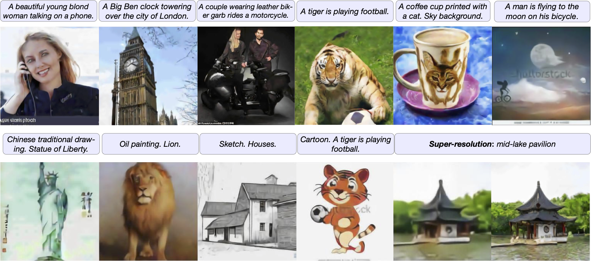

<p align="center">
    
</p>
<p align="center">
<b>Generate vivid Images for <i>Any</i> (Chinese) text</b>
</p>



CogView is a pretrained (4B-param) transformer for text-to-image generation in general domain.

* **Read** our paper [CogView: Mastering Text-to-Image Generation via Transformers](https://arxiv.org/pdf/2105.13290.pdf) on ArXiv for a formal introduction. The *PB-relax* and *Sandwich-LN* can also help you train large and deep transformers stably (e.g. eliminating NaN losses).
* **Visit** our demo at https://lab.aminer.cn/cogview/index.html! (Without post-selection or super-resolution, currently only supports simplified Chinese input, but one can translate text from other languages into Chinese for input)
* **Download** our pretrained models from [Project Wudao-Wenhui](https://resource.wudaoai.cn/home?ind=2&name=WuDao%20WenHui&id=1399364355975327744)（悟道-文汇）.
* **Cite** our paper if you find our work is helpful~ 
```
@article{ding2021cogview,
  title={CogView: Mastering Text-to-Image Generation via Transformers},
  author={Ding, Ming and Yang, Zhuoyi and Hong, Wenyi and Zheng, Wendi and Zhou, Chang and Yin, Da and Lin, Junyang and Zou, Xu and Shao, Zhou and Yang, Hongxia and Tang, Jie},
  journal={arXiv preprint arXiv:2105.13290},
  year={2021}
```
## Getting Started
### Setup
* Hardware: Linux servers with Nvidia V100s or A100s are recommended, but it is also okay to run the pretrained models with smaller `--max-inference-batch-size` or training smaller models on less powerful GPUs.
* Environment (Option 1): Please first install PyTorch (>=1.7.0) and [apex](https://github.com/NVIDIA/apex), and then install other dependencies via `pip install -r requirements.txt`.

* Environment (Option 2): We prepare a docker image in case that you fail to handle the environments. Pull the image, create a (background) container and get into it via:
    ```
    docker pull cogview/cuda111_torch181_deepspeed040
    ./env/start_docker.sh && docker exec -it bg-cogview bash
    
    cd /root/cogview # in the container
    ```

### Download
0. Download the image tokenizer `vqvae_hard_biggerset_011.pt` from [BAAI website](https://resource.wudaoai.cn/home?ind=2&name=WuDao%20WenHui&id=1399364355975327744) or Tsinghua Cloud. Place the file under `pretrained/vqvae`.
```
wget https://cloud.tsinghua.edu.cn/f/71607a5dca69417baa8c/?dl=1 -O pretrained/vqvae/vqvae_hard_biggerset_011.pt
```
1. Download models from [Project Wudao-Wenhui](https://resource.wudaoai.cn/home?ind=2&name=WuDao%20WenHui&id=1399364355975327744). 
    |  FileName   | Discription  |
    |  ----  | ----  |
    | cogview-base.tar | The pretrained text-to-image model. |
    | cogview-caption.tar | Finetuned image-to-text model, also used for reranking. |
    | cogview-sr.tar | Finetuned super-resolution model. (warning: it runs slow.) |

    Uncompress them into `pretrained/cogview/`. The following command should be modified based on the model name.
    ```
    tar -xvf cogview-{base, sr, caption}.tar -C pretrained/cogview/
    ```
2. (Only for training tutorial, skip it for inference.) Download the Alibaba item-title image tokens dataset from our link at [Tianchi]()(*TODO*). Place the lmdb folder under `./data`.

### Run CogView! (Model Inference)
We encapsulate the generation functions into scripts. See `generate_samples.py` and `arguments.py` for details.

#### Text-to-Image Generation
Write text queries (one per line) into `input.txt` and run:
```
./scripts/text2image.sh --debug
```
The results will in a new folder `samples_text2image/`.

Arguments useful in inference are mainly:
* `--input-source [path or "interactive"]`. The path of the input file, can also be "interactive", which will launch a CLI.
* `--output-path [path]`. The folder containing the results.
* `--batch-size [int]`. The number of samples will be generated per query.
* `--max-inference-batch-size [int]`. Maximum batch size per forward. Reduce it if OOM. 
* `--debug`. Only save concatenated images for all generated samples, and name them by input text and date. 
* `--with-id`. When it toggled, you must specify an "id" before each input, e.g. `001\t一个漂亮的女孩`, \t denoting TAB (**NOT space**). It will generate `batch-size` split images in a folder named "id" for each input. Confict with `--debug`.
* `--device [int]`. Running on which GPU. 
* `--offload`. Whether to offload model loading on the CPU. (For loading on GPUs w/ <16GB vRAM)

#### Super-resolution
Run the following script and input `text\t{image_path}`, where `{image_path}` means the path of a previously generated image.
```
./scripts/super_resolution.sh
```
Note: *It is only effective for generated images from our Image Tokenizer (due to the token distribution).*

#### Image-to-Text
The input is "one image path per line", and will print the results to stdout.
```
./scripts/image2text.sh
``` 
Note: *Not optimized for this task, so it might not very competitive (but okay). We will consider to release a version funetuning for a longer period on this task in the future.* (*TODO*)

#### Post-selection
This application only takes file inputs, where each line is `{text}\t{image_path1}\t{image_path2}\t{image_path3}...`.
The output is `{output_path}/scores.txt`, a line of a list of scores, following a line from inputs.
```
./scripts/post_selection.sh
```

Note: *In the released codes, for simplicity, we did not expose the raw API , which supports some advanced generation modes, e.g. text and part of image.*

## Training
Here we use a subset of our dataset from Alibaba item-title for tutorial.
### Single Node 
After downloading the dataset, directly run
```
./scripts/pretrain_single_node.sh
```
### Multiple Nodes 
If you want to train the models on multiple servers inter-connected by infiniband without a shared file system (you may need `pdsh` to accelerate this process):
1. On **each** server, use `git clone` to download this repo, and make sure the data (LMDB format) are moved into the `data` subfolder. 
2. On **each** server, `echo "ip1 ip2 <other IPs>" > ./docker/ip_list.txt`, and then start the docker by `./env/start_docker.sh`.
3. Get into **the docker on the first node** container via `docker exec -it bg-cogview bash`.
4. Get into `/root/cogview` and run `./scripts/pretrain_multiple_nodes.sh`. You may need to change the config (especially `OPTIONS_NCCL`) in the shell script.

See the `arguments.py` for advanced functions for training.
*TODO*

## Gallery

